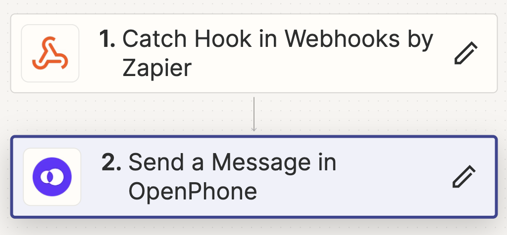

# openphone-bulk-sms
When you need to send a bulk sms to your customers on Openphone in a one-off instance, such as notifying them of changing your phone number or shutting it down. Please use responsibly. 



## Configuration

To configure this project, follow these steps:

1. Create a configuration file (`config.json`) with the following content:

   **config.json**:
   ```json
   {
       "webhook_url": "https://hooks.zapier.com/hooks/catch/abcdefg",
       "phone_number": "123-456-7890"
   }

## Extracting Unique Phone Numbers

To extract all unique phone numbers from your OpenPhone data, follow these steps:

1. **Export Your Data**: Export your contacts, calls, and messages data from OpenPhone and receive them as CSV files.
2. **Prepare the CSV Files**: Place the exported CSV files in the same directory as this script and name them as follows:
   - Contacts CSV: `contacts.csv`
   - Calls CSV: `calls.csv`
   - Messages CSV: `messages.csv`
3. **Configuration**: Create a configuration file named `config_extract_phones.json` with the following content:
   ```json
   {
       "contacts_csv": "contacts.csv",
       "calls_csv": "calls.csv",
       "messages_csv": "messages.csv",
       "output_csv": "unique_phone_numbers.csv"
   }
