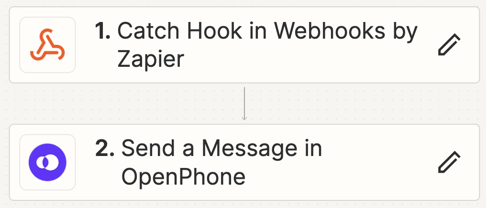

# OpenPhone Bulk SMS

When you need to send a bulk SMS to your customers on OpenPhone in a one-off instance, such as notifying them of changing your phone number or shutting it down. Please use responsibly. 



## Configuration

To configure this project, follow these steps:

1. Create a configuration file (`config.json`) with the following content:

   **config.json**:
   ```json
   {
       "webhook_url": "YOUR_ZAPIER_WEBHOOK_URL",
       "csv_path": "path/to/your/csvfile.csv"
   }
   ```

   The CSV should have one column called `phone_number`. 

## Extracting Unique Phone Numbers

To extract all unique phone numbers from your OpenPhone data, follow these steps:

1. **Export Your Data**: Export your contacts, calls, and messages data from OpenPhone and receive them as CSV files.
2. **Prepare the CSV Files**: Place the exported CSV files in the same directory as this script and name them as follows:
   - Contacts CSV: `contacts.csv`
   - Calls CSV: `calls.csv`
   - Messages CSV: `messages.csv`
3. **Configuration**: Create a configuration file named `config_extract_phones.json` with the following content:
   ```json
   {
       "contacts_csv": "contacts.csv",
       "calls_csv": "calls.csv",
       "messages_csv": "messages.csv",
       "output_csv": "unique_phone_numbers.csv"
   }
   ```

## Bulk SMS Webhook Sender

This script reads phone numbers from a CSV file and sends each number to a specified webhook URL. It ensures fault tolerance by logging responses, handling errors, and saving progress to the CSV file. The script also features a progress bar and configurable sleep interval between requests.

### Features

- **Reads phone numbers from a CSV file**: The CSV file must have a column named `phone_number`.
- **Sends POST requests to a webhook**: The script sends each phone number to a specified webhook URL.
- **Fault tolerance**:
  - Logs responses and errors to a log file.
  - Saves response status, response text, and timestamp to the CSV file after each request.
  - Skips phone numbers that have already been processed, based on the presence of a timestamp.
- **Progress bar**: Uses tqdm to display a progress bar for the processing of phone numbers.
- **Configurable sleep interval**: The sleep interval between requests can be set in the configuration file.
- **Handles missing columns**: Ensures that required columns (`timestamp`, `status_code`, `response_text`, and `error_message`) exist in the CSV file.

### Configuration

The script is configured using a `config.json` file. The configuration file must include the following fields:

- `webhook_url`: The URL of the webhook to which the phone numbers will be sent.
- `csv_path`: The path to the CSV file containing the phone numbers.
- `sleep_interval` (Optional): The number of seconds to wait between requests. Defaults to 3 seconds if not specified.

**Example `config.json`:**
```json
{
    "webhook_url": "YOUR_WEBHOOK_URL_HERE",
    "csv_path": "path/to/your/file.csv",
    "sleep_interval": 3
}
```

### CSV File

The CSV file should have at least one column named `phone_number`. The script will add the following columns if they do not exist:

- `timestamp`: The timestamp when the phone number was processed.
- `status_code`: The HTTP status code returned by the webhook.
- `response_text`: The response text returned by the webhook.
- `error_message`: Any error message encountered during the request.

### Usage

To run the script, use the following command:

```bash
python send_webhook.py
```

### Extracting Unique Phone Numbers Script Usage

To extract unique phone numbers from the exported OpenPhone data, run the script with the following command:

```bash
python extract_unique_phone_numbers.py
```

Ensure you have the `config_extract_phones.json` file properly configured as mentioned above.